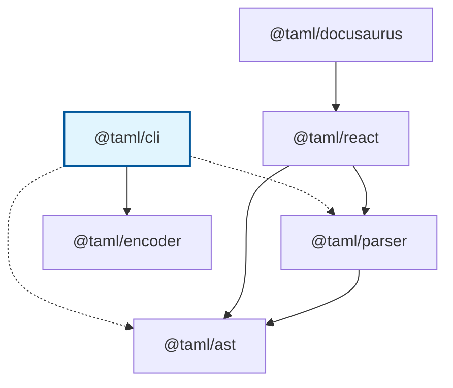

# @taml/cli

> Command-line tool for converting ANSI escape sequences to TAML (Terminal ANSI Markup Language) format in batch operations.

[](https://www.npmjs.com/package/@taml/cli)
[](https://www.npmjs.com/package/@taml/cli)
[](https://www.typescriptlang.org/)
[](https://opensource.org/licenses/MIT)
[](https://github.com/suin/taml-cli/actions/workflows/ci.yml)
[](https://github.com/suin/taml-cli/actions/workflows/publish.yml)

## TAML Ecosystem

**TAML (Terminal ANSI Markup Language)** is a lightweight markup language for styling terminal output with ANSI escape codes. For the complete specification, visit the [TAML Specification Repository](https://github.com/suin/taml-spec).

### Package Dependencies



### Related Packages

#### Core Infrastructure

- **[@taml/ast](https://github.com/suin/taml-ast)** - Foundation package providing AST node types, visitor patterns, and tree traversal utilities for TAML documents.
- **[@taml/parser](https://github.com/suin/taml-parser)** - Robust parser that converts TAML markup strings into typed AST nodes with comprehensive error handling and validation.

#### Input/Output Tools

- **[@taml/encoder](https://github.com/suin/taml-encoder)** - Converts raw ANSI escape sequences into clean TAML markup for further processing and manipulation.
- **[@taml/cli](https://github.com/suin/taml-cli)** - Command-line tool for converting ANSI escape sequences to TAML format in batch operations.

#### Integration Packages

- **[@taml/react](https://github.com/suin/taml-react)** - React component that renders TAML markup as styled JSX elements with full TypeScript support and performance optimization.
- **[@taml/docusaurus](https://github.com/suin/taml-docusaurus)** - Docusaurus theme that automatically detects and renders TAML code blocks in documentation sites.

## Installation

### Global Installation (Recommended)

```bash
npm install -g @taml/cli
```

### Local Installation

```bash
npm install @taml/cli
```

### Alternative Package Managers

#### npm
```bash
npm install -g @taml/cli
```

#### yarn
```bash
yarn global add @taml/cli
```

#### pnpm
```bash
pnpm add -g @taml/cli
```

#### bun
```bash
bun add -g @taml/cli
```

### Verify Installation

```bash
taml --version
```

## Quick Start

Here's a 5-minute introduction to converting terminal output to readable TAML markup:

```bash
# Basic usage - pipe any command output
git status | taml

# Convert colored logs
npm install | taml

# Process build output
npm run build | taml

# Save output to file
docker logs container-name | taml > output.taml

# Chain with other tools
cat app.log | taml | grep "ERROR"
```

**Before (Raw ANSI):**
```bash
echo -e "\033[31mError:\033[0m \033[1mFile not found\033[0m"
# Output: [31mError:[0m [1mFile not found[0m
```

**After (Clean TAML):**
```bash
echo -e "\033[31mError:\033[0m \033[1mFile not found\033[0m" | taml
# Output: <red>Error:</red> <bold>File not found</bold>
```

## Usage Examples

### Basic Command Conversion

#### Git Output
```bash
# Convert Git status
git status | taml

# Sample output:
# On branch <green>main</green>
# Your branch is up to date with 'origin/main'.
# 
# Changes not staged for commit:
#   <red>modified:   src/app.ts</red>
#   <red>modified:   README.md</red>
```

#### Build Tools
```bash
# Convert npm output
npm run build | taml

# Sample output:
# <bold><blue>Building application...</blue></bold>
# 
# <green>✓</green> Compiling TypeScript
# <green>✓</green> Bundling assets
# <yellow>⚠</yellow> Large bundle size detected
# <green>✓</green> Build completed successfully!
```

#### Test Results
```bash
# Convert test runner output
npm test | taml

# Sample output:
# <bold><blue>Running test suite...</blue></bold>
# 
# <bold>Authentication Tests</bold>
#   <green>✓</green> should login with valid credentials <dim>(15ms)</dim>
#   <green>✓</green> should reject invalid password <dim>(8ms)</dim>
#   <red>✗</red> should handle expired tokens <dim>(23ms)</dim>
```

### File Processing

#### Process Log Files
```bash
# Convert application logs
cat /var/log/app.log | taml > readable-logs.taml

# Process multiple files
for log in *.log; do
  cat "$log" | taml > "${log%.log}.taml"
done

# Filter and convert
grep "ERROR" app.log | taml > errors.taml
```

#### Batch Processing
```bash
# Process all log files in directory
find /var/log -name "*.log" -exec sh -c 'cat "$1" | taml > "${1%.log}.taml"' _ {} \;

# Convert with timestamps
ls -la --color=always | taml > directory-listing.taml

# Process Docker logs
docker logs my-container 2>&1 | taml > container-logs.taml
```

### Advanced Usage

#### Streaming Processing
```bash
# Real-time log monitoring
tail -f /var/log/app.log | taml

# Process continuous output
npm run dev | taml

# Monitor build processes
docker build . | taml
```

#### Integration with Other Tools
```bash
# Combine with grep for filtering
docker logs container | taml | grep -E "<red>|<yellow>"

# Use with less for paging
npm run build | taml | less -R

# Pipe to file and display
git log --oneline --color=always | tee >(taml > git-log.taml) | taml
```

#### CI/CD Integration
```bash
# In GitHub Actions
- name: Build and convert output
  run: |
    npm run build 2>&1 | taml > build-output.taml
    
# In Jenkins pipeline
sh 'npm test 2>&1 | taml > test-results.taml'

# In GitLab CI
script:
  - npm run deploy | taml > deployment-log.taml
```

## Practical Scenarios

### 1. Development Workflow

#### Debug Build Issues
```bash
# Capture build errors with colors preserved
npm run build 2>&1 | taml > build-debug.taml

# Compare different build outputs
npm run build:dev | taml > dev-build.taml
npm run build:prod | taml > prod-build.taml
diff dev-build.taml prod-build.taml
```

#### Monitor Development Server
```bash
# Convert dev server output for analysis
npm run dev | taml > dev-server.taml &
DEV_PID=$!

# Later, analyze the output
kill $DEV_PID
grep -E "<red>|<yellow>" dev-server.taml
```

### 2. DevOps and Monitoring

#### Container Logs
```bash
# Convert Docker container logs
docker logs --follow my-app | taml > app-logs.taml

# Process Kubernetes pod logs
kubectl logs -f deployment/my-app | taml > k8s-logs.taml

# Analyze deployment logs
kubectl rollout status deployment/my-app | taml > deployment-status.taml
```

#### System Monitoring
```bash
# Convert system logs
journalctl -f | taml > system-logs.taml

# Process service status
systemctl status nginx | taml > nginx-status.taml

# Monitor resource usage
top -b -n1 | taml > system-resources.taml
```

### 3. Documentation Generation

#### Capture Command Examples
```bash
# Generate documentation examples
echo "# Git Status Example" > docs/git-example.md
echo '```taml' >> docs/git-example.md
git status | taml >> docs/git-example.md
echo '```' >> docs/git-example.md

# Create build output documentation
echo "# Build Process" > docs/build-process.md
echo '```taml' >> docs/build-process.md
npm run build | taml >> docs/build-process.md
echo '```' >> docs/build-process.md
```

#### Tutorial Creation
```bash
# Create interactive tutorials with preserved colors
mkdir tutorial-outputs
git init | taml > tutorial-outputs/01-git-init.taml
git add . | taml > tutorial-outputs/02-git-add.taml
git commit -m "Initial commit" | taml > tutorial-outputs/03-git-commit.taml
```

### 4. Testing and Quality Assurance

#### Test Output Analysis
```bash
# Convert test results for analysis
npm test | taml > test-results.taml

# Extract failed tests
grep -A 5 -B 1 "<red>✗</red>" test-results.taml > failed-tests.taml

# Compare test runs
npm test | taml > current-tests.taml
diff baseline-tests.taml current-tests.taml
```

#### Performance Monitoring
```bash
# Capture benchmark results
npm run benchmark | taml > benchmark-results.taml

# Monitor memory usage during tests
npm test 2>&1 | taml > test-with-memory.taml
```

## Command Reference

### Usage
```bash
taml [options]
```

### Input Methods

#### Standard Input (Recommended)
```bash
# Pipe from commands
command | taml

# Redirect from files
taml < input.log

# Here documents
taml << EOF
$(echo -e "\033[31mRed text\033[0m")
EOF
```

#### File Processing
```bash
# Process single file
cat file.log | taml > output.taml

# Process multiple files
cat *.log | taml > combined.taml

# Process with error handling
cat file.log 2>/dev/null | taml > output.taml || echo "Processing failed"
```

### Output Options

#### Standard Output
```bash
# Direct output to terminal
command | taml

# Pipe to other commands
command | taml | grep "pattern"

# Combine with pagers
command | taml | less -R
```

#### File Output
```bash
# Save to file
command | taml > output.taml

# Append to file
command | taml >> output.taml

# Split output
command | taml | tee output.taml | grep "ERROR"
```

### Exit Codes

| Code | Description                                    |
| ---- | ---------------------------------------------- |
| `0`  | Success - conversion completed                 |
| `1`  | Error - no input provided or processing failed |

### Error Handling

The CLI tool provides comprehensive error handling:

#### No Input Provided
```bash
$ taml
Error: No input provided. Please pipe ANSI text to this command.
Usage: cat file.txt | taml-cli
       echo -e "\e[31mRed text\e[0m" | taml-cli
```

#### Processing Errors
```bash
# Malformed ANSI sequences are passed through
echo -e "Normal \033[XYZ Invalid \033[31mRed\033[0m" | taml
# Output: Normal [XYZ Invalid <red>Red</red>
```

#### Large File Handling
```bash
# Efficiently processes large files
cat large-file.log | taml > large-output.taml

# Memory-efficient streaming
tail -f continuous.log | taml
```

## Supported ANSI Features

### Colors

#### Standard Colors (30-37)
- **Black** (`\033[30m`) → `<black>`
- **Red** (`\033[31m`) → `<red>`
- **Green** (`\033[32m`) → `<green>`
- **Yellow** (`\033[33m`) → `<yellow>`
- **Blue** (`\033[34m`) → `<blue>`
- **Magenta** (`\033[35m`) → `<magenta>`
- **Cyan** (`\033[36m`) → `<cyan>`
- **White** (`\033[37m`) → `<white>`

#### Bright Colors (90-97)
- **Bright Black** (`\033[90m`) → `<brightBlack>`
- **Bright Red** (`\033[91m`) → `<brightRed>`
- **Bright Green** (`\033[92m`) → `<brightGreen>`
- **Bright Yellow** (`\033[93m`) → `<brightYellow>`
- **Bright Blue** (`\033[94m`) → `<brightBlue>`
- **Bright Magenta** (`\033[95m`) → `<brightMagenta>`
- **Bright Cyan** (`\033[96m`) → `<brightCyan>`
- **Bright White** (`\033[97m`) → `<brightWhite>`

#### Background Colors (40-47, 100-107)
- **Standard Backgrounds**: `<bgBlack>`, `<bgRed>`, `<bgGreen>`, etc.
- **Bright Backgrounds**: `<bgBrightBlack>`, `<bgBrightRed>`, etc.

### Text Styles

#### Formatting
- **Bold** (`\033[1m`) → `<bold>`
- **Dim** (`\033[2m`) → `<dim>`
- **Italic** (`\033[3m`) → `<italic>`
- **Underline** (`\033[4m`) → `<underline>`
- **Strikethrough** (`\033[9m`) → `<strikethrough>`

#### Reset Sequences
- **Full Reset** (`\033[0m`) → Closes all open tags
- **Foreground Reset** (`\033[39m`) → Removes color formatting
- **Background Reset** (`\033[49m`) → Removes background formatting

### Advanced Features

#### Extended Colors
- **256-Color Palette** (`\033[38;5;n`) → Mapped to closest standard color
- **RGB Colors** (`\033[38;2;r;g;b`) → Converted to nearest standard color
- **Background Extended** (`\033[48;5;n`, `\033[48;2;r;g;b`) → Background variants

#### Nested Formatting
```bash
# Complex nesting is properly handled
echo -e "\033[1m\033[4m\033[31mBold Underlined Red\033[0m" | taml
# Output: <bold><underline><red>Bold Underlined Red</red></underline></bold>
```

## Integration with TAML Ecosystem

### With Parser
```bash
# Convert ANSI to TAML, then parse with @taml/parser
echo -e "\033[31mError\033[0m" | taml | node -e "
  const { parse } = require('@taml/parser');
  const { getAllText } = require('@taml/ast');
  
  let input = '';
  process.stdin.on('data', chunk => input += chunk);
  process.stdin.on('end', () => {
    const ast = parse(input.trim());
    console.log('Plain text:', getAllText(ast));
  });
"
```

### With React Components
```bash
# Generate TAML for React components
git status | taml > src/examples/git-status.taml

# Use in React app
import { parse } from '@taml/parser';
import { TamlRenderer } from '@taml/react';
import gitStatusTaml from './examples/git-status.taml';

function GitExample() {
  const ast = parse(gitStatusTaml);
  return <TamlRenderer ast={ast} />;
}
```

### With Documentation Tools
```bash
# Generate documentation examples
mkdir docs/examples
git log --oneline --color=always | head -10 | taml > docs/examples/git-log.taml
npm test | taml > docs/examples/test-output.taml
docker build . | taml > docs/examples/docker-build.taml

# Use with Docusaurus
# Files are automatically detected and rendered by @taml/docusaurus
```

### Complete Processing Pipeline
```bash
# ANSI → TAML → AST → Analysis pipeline
echo -e "\033[31mERROR:\033[0m \033[1mDatabase connection failed\033[0m" | \
  taml | \
  node -e "
    const { parse } = require('@taml/parser');
    const { visit, getAllText, getElementsWithTag } = require('@taml/ast');
    
    let input = '';
    process.stdin.on('data', chunk => input += chunk);
    process.stdin.on('end', () => {
      const ast = parse(input.trim());
      const plainText = getAllText(ast);
      const errors = getElementsWithTag(ast, 'red');
      
      console.log('Plain text:', plainText);
      console.log('Error count:', errors.length);
      
      visit(ast, {
        visitElement: (node) => {
          if (node.tagName === 'red') {
            console.log('Found error styling');
          }
        }
      });
    });
  "
```

## Troubleshooting

### Common Issues

#### No Output Produced
**Problem**: Command runs but produces no output
```bash
$ taml
# Shows usage help - no input provided
```

**Solution**: Ensure you're piping input to the command
```bash
$ echo -e "\033[31mTest\033[0m" | taml
<red>Test</red>
```

#### Garbled Output
**Problem**: Output contains unexpected characters

**Cause**: Input may contain binary data or non-text content

**Solution**: Ensure input is text-based terminal output
```bash
# Good: Text with ANSI codes
git log --oneline --color=always | taml

# Avoid: Binary files
cat image.png | taml  # Will produce garbled output
```

#### Performance Issues
**Problem**: Slow processing of large files

**Solution**: Use streaming or process in chunks
```bash
# Process in chunks
head -n 1000 large.log | taml > first-1000.taml
tail -n 1000 large.log | taml > last-1000.taml

# Use streaming for real-time processing
tail -f large.log | taml
```

#### Memory Usage
**Problem**: High memory usage with very large files

**Solution**: Use streaming processing
```bash
# Instead of loading entire file
cat huge-file.log | taml > output.taml

# Use streaming tools
tail -f continuous.log | taml | head -n 100
```

### Platform-Specific Issues

#### Windows
**PowerShell**: Full compatibility
```powershell
Get-Content app.log | taml
```

**Command Prompt**: Basic compatibility
```cmd
type app.log | taml
```

**WSL**: Full compatibility (recommended for Windows)
```bash
cat app.log | taml
```

#### macOS/Linux
**Full compatibility** with all shell features
```bash
cat app.log | taml
ls -la --color=always | taml
git status | taml
```

#### Docker/Containers
```bash
# Process container logs
docker logs container-name | taml

# Use in Dockerfile
RUN npm run build | taml > build-output.taml

# Kubernetes
kubectl logs pod-name | taml
```

### Debugging

#### Verbose Output
```bash
# Check if ANSI sequences are present
cat file.log | od -c | grep -E '\\033|\\x1b'

# Test with simple input
echo -e "\033[31mRed\033[0m" | taml

# Verify encoding
echo -e "\033[31mRed\033[0m" | taml | od -c
```

#### Input Validation
```bash
# Check for valid ANSI sequences
cat file.log | grep -E '\033\[[0-9;]*m'

# Test with known good input
echo -e "\033[32mGreen\033[0m \033[1mBold\033[0m" | taml
```

## Performance Considerations

### Optimization Tips

#### Efficient Processing
```bash
# For large files, use streaming
tail -f large.log | taml

# Process specific patterns only
grep "ERROR\|WARN" app.log | taml

# Use head/tail for samples
head -n 100 large.log | taml
```

#### Memory Management
```bash
# Avoid loading entire large files
# Good:
cat large.log | taml > output.taml

# Less efficient:
taml < large.log > output.taml
```

#### Batch Processing
```bash
# Process multiple files efficiently
find . -name "*.log" -print0 | xargs -0 -I {} sh -c 'cat "{}" | taml > "{}.taml"'

# Parallel processing
find . -name "*.log" | xargs -P 4 -I {} sh -c 'cat "{}" | taml > "{}.taml"'
```

### Benchmarks

Typical performance on modern hardware:

- **Small files** (< 1MB): < 10ms
- **Medium files** (1-10MB): < 100ms  
- **Large files** (10-100MB): < 1s
- **Streaming**: Real-time processing

## Contributing

We welcome contributions! Please see our [Contributing Guide](CONTRIBUTING.md) for details.

### Development Setup

```bash
# Clone the repository
git clone https://github.com/suin/taml-cli.git
cd taml-cli

# Install dependencies
bun install

# Run tests
bun test

# Build the project
bun run build

# Test CLI locally
echo -e "\033[31mTest\033[0m" | bun run ts/index.ts
```

### Testing

The project uses Bun for testing with comprehensive E2E test coverage:

```bash
# Run all tests
bun test

# Run tests in watch mode
bun test --watch

# Run with coverage
bun test --coverage
```

### Test Coverage

The CLI is thoroughly tested with:

- **E2E Tests**: Real-world CLI execution using `npx .` to test the actual binary
- **ANSI Conversion**: Complete ANSI-to-TAML conversion scenarios
- **Edge Cases**: Malformed sequences, empty input, large files
- **Process Validation**: Exit codes, stdout/stderr handling
- **Platform Tests**: Cross-platform compatibility

The E2E testing approach ensures that the CLI works exactly as users will experience it, testing the complete pipeline from ANSI input through the actual compiled binary to TAML output.

### Code Quality

```bash
# Lint code
bun run lint

# Format code
bun run format

# Type checking
bun run build
```

## Requirements

### System Requirements
- **Node.js**: Version 18 or higher
- **Operating System**: Windows, macOS, Linux
- **Terminal**: Any terminal that supports ANSI escape sequences

### Dependencies
- **[@taml/encoder](https://github.com/suin/taml-encoder)**: Core ANSI-to-TAML conversion library

### Optional Dependencies
- **[@taml/parser](https://github.com/suin/taml-parser)**: For further processing of TAML output
- **[@taml/ast](https://github.com/suin/taml-ast)**: For AST manipulation of parsed TAML

## License

MIT © [suin](https://github.com/suin)

## Support

- **Issues**: [GitHub Issues](https://github.com/suin/taml-cli/issues)
- **Documentation**: [TAML Specification](https://github.com/suin/taml-spec)
- **Community**: [GitHub Discussions](https://github.com/suin/taml-cli/discussions)

---

**Part of the TAML ecosystem** - Visit the [TAML Specification](https://github.com/suin/taml-spec) for more information about the Terminal ANSI Markup Language.